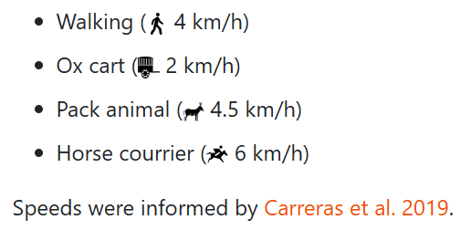

# Itiner-e: The Digital Atlas of Ancient Roads

[Itiner-e](https://itiner-e.org) is an open digital atlas of Roman roads. Its aim is to provide a platform for the scholarly community to share data about the Roman roads, to grow the the dataset together and to disseminate the knowledge about the Roman roads to the public. It is an ongoing collaborative effort and for this reason we created this repository as a starting point for all researchers who wants to contribute their data. If you want to start contributing, **read the tutorial**, download the **templates** and [**contact**](#contacts) **us**, so that we can discuss the specifics of your contribution, create an user account for you on the platform and add you to the shared [zotero](https://www.zotero.org/groups/5141113/itiner-e) library.

The original data paper, describing the dataset, the methodology of data collection and other technical details is available in open access [here](https://doi.org/10.1038/s41597-025-06140-z).

#### **Contents**

1. [Description of the repository](#description-of-the-repository)
2. [Passability modifier](#passability-modifier)
3. [Useful resources](#useful-resources)
4. [Contacts](#contacts)

### Description of the repository

The [**itiner-e\_tutorial**](itiner-e_tutorial.pdf) contains basic introduction into the goals of the project, data structure employed for the road data, introduction to the web platform,  workflows on how to upload and edit the data online and workflows for QGIS and ArcGIS on how to calculate certain data attributes required for the database.

Templates in GeoJson and Shapefile formats to be used for data digitization in GIS are stored in [**templates**](/templates) folder. GeoJson file is formated according to the instructions and template on the website and so it can be uploaded to the database without any editing. The Shapefile template has truncated field names due to technical limitations, so upon upload a field mapping must be done (see complete instructions in the tutorial).

Custom python code to calculate an average slope along a road segment in QGIS is in the [**itiner-e\_avgSlope\_PyQGIS**](itiner-e_avgSlope_PyQGIS.txt) file. Its contents can be copied and pasted directly in the PyQGIS editor in QGIS. You only need to change the names of the road layer and DEM layer in the code (see complete instructions in the tutorial).

### Passability modifier

In order to incorporate friction of movement in difficult topography for the routing tool function, we introduce a passability modifier that reduces speed of a given mean of transport. The time calculation in the routing tool is calculated simply as Time = Distance / Velocity, where speeds of various means of transport are pre-defined.

Passability modifier (M) modifies the time calculations as follows: 

$$T = \\frac{D}{V \\times M}$$

The modifier expresses friction of movement on slope using Tobler's hiking function with some modifications.

* We do not consider negative slopes (since maximum speed according to Tobler's formula is achieved while walking downhill on a 2.86° slope, i.e., -2.86°).
* We do not consider direction of movement (uphill/downhill which can be changing over a course of a single road segment).
* The average slope therefore averages difficulties of moving uphill and downhill in both directions along the whole road segment.

How it is calculated: if we consider that maximum speed is achieved on a slope of 0° (since we do not consider negative slope), the modifier is a fraction of speed of movement on a given slope to a speed of movement on 0° slope:

$$M = \\frac{V(\\text{average slope of road segment})}{V(\\text{on slope } 0^\\circ)}$$

Using the Tobler's formula we get:

&#x20;

$$
M = \\frac{6e^{-3.5\\left|\\tan\\left(\\theta \\frac{\\pi}{180}\\right)+0.05\\right|}}
{6e^{-3.5\\left|\\tan(0) + 0.05\\right|}}
$$

If we simplify then:

$$
M = \\frac{e^{-3.5\\left|\\tan\\left(\\theta \\frac{\\pi}{180}\\right)+0.05\\right|}}
{e^{-3.5\\left|\\tan(0) + 0.05\\right|}}
$$

Since

$$
e^{-3.5\\left|\\tan(0)+0.05\\right|}=0.839457,
$$

the expression becomes

$$
M = \\frac{e^{-3.5\\left|\\tan\\left(\\theta \\frac{\\pi}{180}\\right)+0.05\\right|}}{0.839457}
$$

The modifier has value between 0 (impassable) to 1 (no speed penalty). Moreover, we apply the modifier only to slopes larger than 6% (ca. 3.43°), assuming roads below this threshold allow more or less frictionless movement.

The code for the field calculator in ArcGIS then looks like this:

*Reclass(!avgSlope!)*

*def Reclass(avgSlope):*

&#x20;   *if (avgSlope > 3.43):*

&#x20;       *return math.exp(-3.5 \* (math.atan(avgSlope \* math.pi / 180)+0.05)) / 0.839457*

&#x20;   *elif (avgSlope < 3.43):*

&#x20;       *return 1*

And for field calculator in QGIS as this:

*CASE*

&#x20;   *WHEN "avgSlope" > 3.43 THEN*

&#x20;       *exp(*

&#x20;           *-3.5 \* (*

&#x20;               *atan("avgSlope" \* pi() / 180) + 0.05*

&#x20;           *)*

&#x20;       *) / 0.839457*

&#x20;   *ELSE*

&#x20;       *1*

*END*

### Useful resources

Project's [zotero library](https://www.zotero.org/groups/5141113/itiner-e)

[Pleiades Gazetteer](https://pleiades.stoa.org/downloads)

[Ancient World Mapping Center](https://awmc.unc.edu)

[Ancient World Mapping Center github](https://github.com/AWMC/geodata)

[Mapping Past Societies](https://darmc.harvard.edu)

[Project Mercury](https://projectmercury.eu)

[Overview of openly available DEM data](https://github.com/DahnJ/Awesome-DEM)

[QuickMapServices](https://plugins.qgis.org/plugins/quick_map_services/) plugin to QGIS allowing searching and adding various basemaps and satellite imagery to QGIS.

### Contacts

Adam Pažout (Adam.Pazout@uab.cat)

Tom Brughmans (t.b@cas.au.dk)

Pau de Soto (PauDe.Soto@uab.cat)

